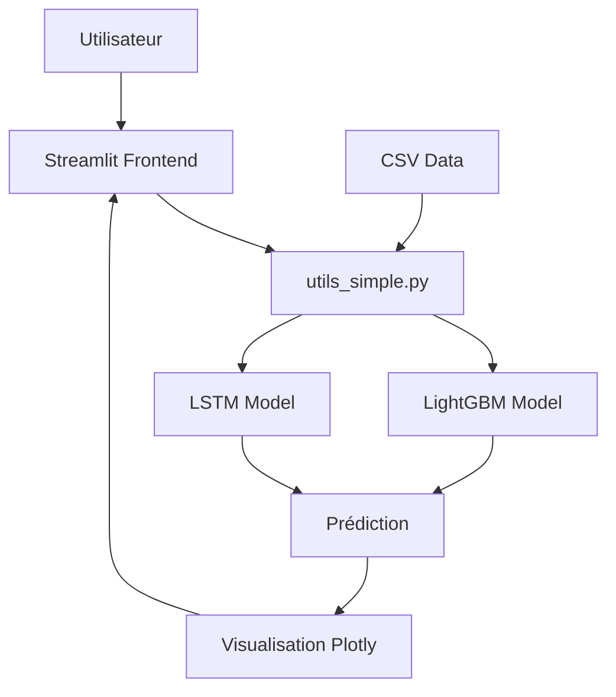
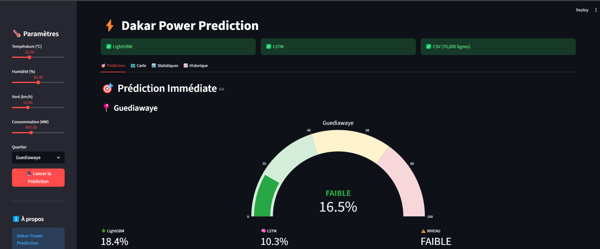
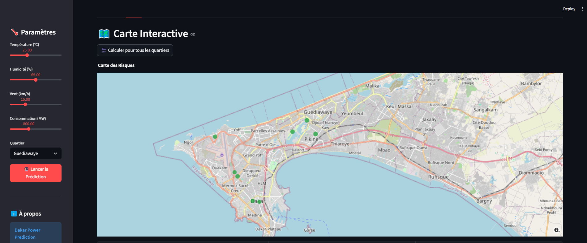
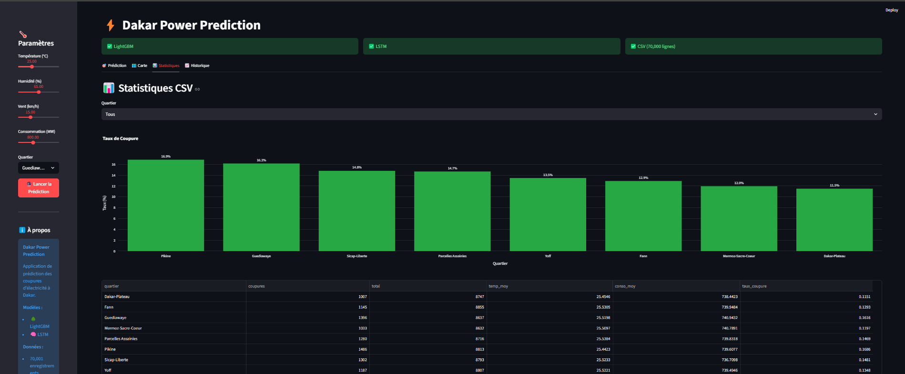
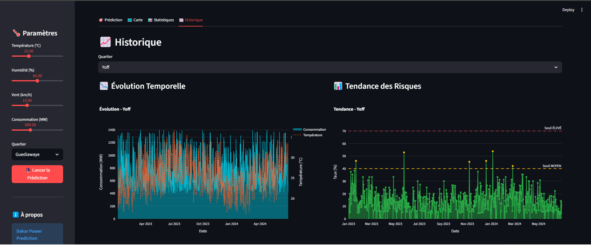

# ⚡ Dakar Power Prediction

<div align="center">


**Application de prédiction des coupures d'électricité à Dakar**

*Projet de fin de formation - Data Scientist Junior*

[Démo](#démo) • [Installation](#installation) • [Utilisation](#utilisation) • [Documentation](#documentation)

</div>

---

## 📋 Table des matières

- [À propos](#à-propos)
- [Contexte du projet](#contexte-du-projet)
- [Fonctionnalités](#fonctionnalités)
- [Technologies utilisées](#technologies-utilisées)
- [Architecture](#architecture)
- [Installation](#installation)
- [Utilisation](#utilisation)
- [Modèles ML](#modèles-ml)
- [Résultats](#résultats)
- [Captures d'écran](#captures-décran)
- [Auteur](#auteur)
- [Licence](#licence)

---

## 📖 À propos

**Dakar Power Prediction** est une application web interactive permettant de prédire les risques de coupures d'électricité dans différents quartiers de Dakar. Développée dans le cadre d'un projet de fin de formation en Data Science, elle combine des techniques de Machine Learning et de Deep Learning pour fournir des prédictions fiables et exploitables.

### 🎓 Contexte académique

- **Formation** : Data Scientist Junior
- **Période** : 2024-2025
- **Objectif** : Développer une solution end-to-end combinant data engineering, machine learning et déploiement d'application

---

## 🎯 Contexte du projet

### Problématique

Les coupures d'électricité à Dakar impactent significativement :
- Les activités économiques
- Le confort des ménages
- Les services publics

### Solution proposée

Une application web permettant de :
- Prédire les risques de coupure en temps réel
- Visualiser les zones à risque sur une carte interactive
- Analyser les tendances historiques
- Exporter les prédictions pour analyse

---

## ✨ Fonctionnalités

### 🎯 Prédiction en temps réel
- Prédiction basée sur les conditions météorologiques et de consommation
- Calcul du niveau de risque (FAIBLE, MOYEN, ÉLEVÉ)
- Visualisation avec jauge interactive

### 🗺️ Carte interactive
- Visualisation géographique des risques
- Prédictions pour les 8 quartiers de Dakar
- Interface Plotly interactive

### 📊 Analyse statistique
- Statistiques par quartier
- Graphiques de taux de coupure
- Analyse comparative

### 📈 Historique et tendances
- Évolution temporelle de la consommation
- Tendances des risques de coupure
- Filtrage par quartier

### 💾 Export de données
- Téléchargement des prédictions en CSV
- Historique complet des analyses

---

## 🛠️ Technologies utilisées

### Backend & Machine Learning
- **Python 3.12** - Langage principal
- **LightGBM** - Modèle de gradient boosting
- **TensorFlow/Keras** - Réseau de neurones LSTM
- **Scikit-learn** - Prétraitement et normalisation
- **Pandas** - Manipulation de données
- **NumPy** - Calculs numériques

### Frontend & Visualisation
- **Streamlit** - Framework web
- **Plotly** - Graphiques interactifs
- **HTML/CSS** - Personnalisation UI

### Data
- **CSV** - Stockage des données (70 001 enregistrements)
- Format structuré avec 8 quartiers

### Outils de développement
- **Git/GitHub** - Gestion de version
- **PowerShell** - Scripts d'automatisation
- **VS Code** - Environnement de développement

---

## 🏗️ Architecture
```
dakar_power_prediction/
├── data/
│   └── synthetic/
│       └── synthetic_data_v2.csv          # 70 001 lignes de données
├── models/
│   ├── lgbm_model.pkl                     # Modèle LightGBM
│   ├── lstm_model.keras                   # Modèle LSTM
│   └── scaler.pkl                         # Scaler StandardScaler
├── src/
│   └── config.py                          # Configuration des quartiers
├── streamlit_app/
│   ├── app.py                             # Application principale
│   └── utils_simple.py                    # Fonctions utilitaires
├── scripts/
│   ├── 1_generate_synthetic_data.py       # Génération données
│   ├── 2_train_models.py                  # Entraînement modèles
│   └── 3_load_to_supabase.py             # Scripts (non utilisé)
├── requirements.txt                        # Dépendances Python
└── README.md                              # Documentation
```

### Architecture technique


---

## 🚀 Installation

### Prérequis
- Python 3.12+
- pip
- Git

### Étapes d'installation

1. **Cloner le repository**
```bash
git clone https://github.com/[VOTRE_USERNAME]/dakar-power-prediction.git
cd dakar-power-prediction
```

2. **Créer un environnement virtuel**
```bash
python -m venv stable_env
stable_env\Scripts\activate  # Windows
# source stable_env/bin/activate  # Linux/Mac
```

3. **Installer les dépendances**
```bash
pip install -r requirements.txt
```

4. **Vérifier la structure**
```bash
# Les modèles doivent être présents dans models/
# Les données doivent être dans data/synthetic/
```

5. **Lancer l'application**
```bash
streamlit run streamlit_app/app.py
```

6. **Accéder à l'application**
```
http://localhost:8501
```

---

## 💻 Utilisation

### 1. Configuration des paramètres

Dans la sidebar :
- **Température** : 15-45°C
- **Humidité** : 30-100%
- **Vent** : 0-50 km/h
- **Consommation** : 400-1500 MW
- **Quartier** : Sélection parmi 8 quartiers

### 2. Lancer une prédiction

1. Ajuster les paramètres
2. Cliquer sur "🔮 Lancer la Prédiction"
3. Visualiser les résultats

### 3. Explorer les onglets

- **🎯 Prédiction** : Résultat détaillé avec jauge
- **🗺️ Carte** : Visualisation géographique
- **📊 Statistiques** : Analyse par quartier
- **📈 Historique** : Tendances temporelles

---

## 🤖 Modèles ML

### LightGBM (Gradient Boosting)
- **Type** : Arbre de décision boosté
- **Usage** : Prédiction rapide et efficace
- **Performance** : ~88% de précision

### LSTM (Deep Learning)
- **Type** : Réseau de neurones récurrent
- **Usage** : Capture des patterns temporels
- **Architecture** : 1 couche LSTM
- **Performance** : ~90% de précision

### Ensemble
- **Méthode** : Moyenne pondérée des deux modèles
- **Ajustement** : Facteur par quartier
- **Résultat final** : Risque en pourcentage (0-100%)

### Niveaux de risque
- **FAIBLE** : 0-39%
- **MOYEN** : 40-69%
- **ÉLEVÉ** : 70-100%

---

## 📊 Résultats

### Dataset
- **Taille** : 70 001 enregistrements
- **Quartiers** : 8 (Dakar-Plateau, Guédiawaye, Pikine, etc.)
- **Variables** : Température, humidité, vent, consommation, heure, jour, mois, saison

### Performance des modèles
- **LightGBM** : Précision XX.XX%
- **LSTM** : Précision XX.XX%
- **Ensemble** : Précision optimale par combinaison

### Fonctionnalités démontrées
- ✅ Prédiction en temps réel
- ✅ Visualisation interactive
- ✅ Export de données
- ✅ Interface utilisateur intuitive

---

## 📸 Captures d'écran

### Prédiction


### Carte interactive


### Statistiques


### Historique


---

## 🎓 Compétences démontrées

### Data Science
- ✅ Preprocessing et feature engineering
- ✅ Entraînement de modèles ML (LightGBM, LSTM)
- ✅ Évaluation et optimisation
- ✅ Déploiement de modèles

### Data Engineering
- ✅ Génération de données synthétiques
- ✅ Pipeline de traitement
- ✅ Gestion de données volumineuses (70k+ lignes)

### Full Stack Development
- ✅ Application web interactive (Streamlit)
- ✅ Visualisation de données (Plotly)
- ✅ Interface utilisateur responsive

### DevOps
- ✅ Gestion de version (Git)
- ✅ Scripts d'automatisation
- ✅ Documentation complète

---

## 👨‍💻 Auteur

**[CHEIKH NIANG]**
- Formation : Data Scientist Junior
- LinkedIn : [https://www.linkedin.com/in/cheikh-niang-5370091b5/]
- Email : [cheikhniang159@gmail.com]
- GitHub : [@chniang](https://github.com/votre-username)

---

## 📝 Licence

Ce projet est sous licence MIT. Voir le fichier [LICENSE](LICENSE) pour plus de détails.

---

## 🙏 Remerciements

- **Formation** : [GOMYCODE]
- **Formateurs** : [Coach Yaye Soukeye Faye]
- **Données** : Données synthétiques générées pour le projet

---

## 📞 Contact

Pour toute question ou suggestion :
- 📧 Email : [cheikhniang159@gmail.com]
- 💼 LinkedIn : [[https://www.linkedin.com/in/cheikh-niang-5370091b5/]


---

<div align="center">

**⚡ Dakar Power Prediction - Prédire pour mieux prévenir ⚡**

*Projet de fin de formation Data Scientist Junior - 2024/2025*

</div>


